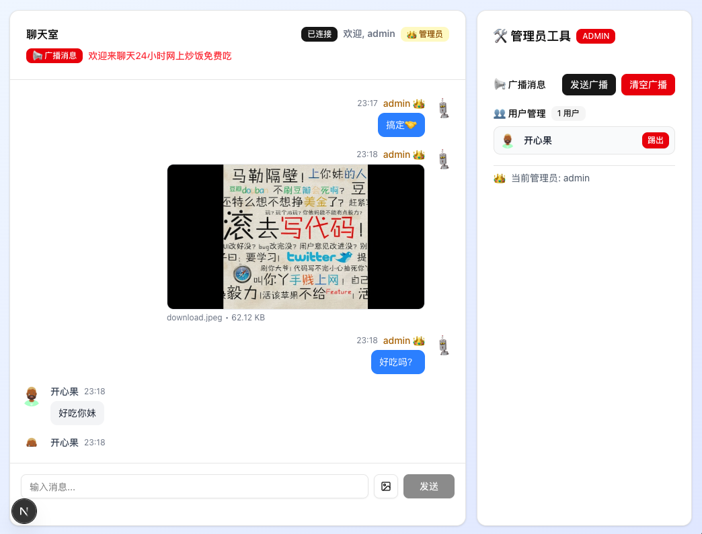

# Next.js WebSocket 聊天室

一个基于 Next.js 自定义服务器和 Socket.IO 的实时聊天应用演示，支持管理员功能、Robohash 头像、智能链接预览和图片分享。

## 应用截图



*展示了完整的聊天室界面，包括实时消息、图片分享、链接预览、管理员工具和用户列表*

## 功能特性

- 🚀 基于 Next.js 15 和自定义服务器
- 💬 实时 WebSocket 通信
- 👥 多用户在线聊天
- 👑 管理员系统
- 📢 广播置顶消息（支持清空功能）
- 🔨 用户管理（踢人功能）
- 🤖 Robohash 动态头像生成
- 🔗 智能链接预览（Open Graph 支持）
- 📸 图片分享功能（实时传输）
- 🔔 智能未读消息提示
- 📜 智能滚动功能（自动/手动）
- 🎨 使用 Tailwind CSS 和 shadcn/ui 的现代化界面
- 📱 响应式设计
- 🔄 自动重连机制
- 👤 唯一昵称验证
- 📜 消息历史记录

## 技术栈

- **前端**: Next.js 15, React 19, TypeScript
- **样式**: Tailwind CSS, shadcn/ui
- **WebSocket**: Socket.IO（支持二进制数据传输）
- **头像**: Robohash.org API
- **链接预览**: Cheerio, node-fetch
- **图片处理**: FileReader API, Blob URL
- **服务器**: Node.js 自定义服务器

## 快速开始

### 安装依赖

```bash
pnpm install
```

### 开发模式

```bash
pnpm dev
```

### 生产模式

```bash
pnpm build
pnpm start
```

## 使用方法

1. 启动服务器后，访问 `http://localhost:3000`
2. 输入一个唯一的昵称加入聊天室
3. 系统会自动为你生成一个独特的头像
4. 开始聊天！发送包含链接的消息会自动显示预览

### 链接预览功能

本应用支持智能链接预览，当你在消息中发送网站链接时：

- **自动检测**: 系统会自动检测消息中的 HTTP/HTTPS 链接
- **Open Graph 支持**: 获取网站的 OG 标签信息（标题、描述、图片等）
- **多链接支持**: 一条消息中的多个链接都会显示预览
- **优雅降级**: 如果无法获取预览信息，会显示基本的链接信息
- **安全性**: 设置了 5 秒超时和适当的用户代理
- **响应式设计**: 预览卡片适配不同屏幕尺寸

#### 支持的预览信息
- 网站标题（og:title 或 title 标签）
- 网站描述（og:description 或 meta description）
- 预览图片（og:image）
- 网站名称（og:site_name）
- 网站图标（favicon）

#### 测试链接预览
尝试发送以下类型的链接：
- 新闻网站：`https://www.bbc.com/news`
- 社交媒体：`https://twitter.com/username`
- 技术文档：`https://nextjs.org/docs`
- GitHub 项目：`https://github.com/vercel/next.js`

### 图片分享功能

本应用支持实时图片分享，让用户可以快速分享图片：

- **支持格式**: JPEG, PNG, GIF, WebP
- **文件大小限制**: 最大 10MB
- **实时传输**: 使用 WebSocket 二进制数据传输
- **预览功能**: 发送前可预览图片
- **全屏查看**: 点击图片可全屏查看
- **下载功能**: 支持下载接收到的图片
- **内存管理**: 自动清理 Blob URL，防止内存泄漏

#### 如何使用图片分享
1. 点击消息输入框旁的 📷 图片按钮
2. 选择要分享的图片文件
3. 可选择添加图片说明文字
4. 点击发送按钮分享图片
5. 其他用户会实时收到图片消息

#### 图片消息特性
- **缩略图显示**: 消息中显示适当大小的缩略图
- **文件信息**: 显示文件名和大小
- **操作按钮**: 悬停显示查看大图和下载按钮
- **响应式**: 适配不同屏幕尺寸
- **加载状态**: 显示图片加载进度

#### 技术实现
- **客户端**: 使用 FileReader API 读取文件为 ArrayBuffer
- **传输**: Socket.IO 支持二进制数据传输
- **显示**: 转换为 Blob URL 在浏览器中显示
- **清理**: 组件卸载时自动清理 Blob URL

### 智能未读消息提示

本应用实现了智能的未读消息提示系统，提升用户体验：

#### 🔔 功能特点
- **智能检测**: 当其他用户发送消息时，检测当前用户是否在查看历史消息
- **悬浮提示**: 在聊天区域右下角显示未读消息数量按钮
- **一键跳转**: 点击按钮平滑滚动到最新消息
- **自动清除**: 用户滚动到底部时自动清除未读计数

#### 🎯 触发条件
- **显示提示**: 用户不在底部（100px阈值）且收到其他用户的新消息
- **不显示提示**: 用户自己发送消息或已在底部附近

#### 🎨 界面设计
- **位置**: 聊天区域右下角悬浮显示
- **样式**: 深蓝色圆角按钮，带向下箭头图标
- **文本**: "1个未读消息" 或 "X个未读消息"
- **动画**: hover时缩放效果，平滑过渡

#### 🔄 清除机制
1. **点击按钮**: 平滑滚动到底部并清除计数
2. **手动滚动**: 用户滚动到底部时自动清除
3. **发送消息**: 用户发送消息时强制滚动并清除

### 智能滚动功能

本应用实现了智能的消息滚动系统，平衡用户体验和功能需求：

#### 📜 滚动策略
- **用户自己的消息**: 强制平滑滚动到底部，确保看到发送结果
- **其他用户消息**: 智能判断用户位置，在底部则滚动，查看历史则不打扰
- **初始加载**: 自动滚动到最新消息

#### 🎯 判断逻辑
- **底部阈值**: 距离底部100px内视为"在底部附近"
- **平滑滚动**: 使用 `behavior: 'smooth'` 提供流畅体验
- **即时滚动**: 初始加载使用即时滚动，避免动画延迟

#### 🔧 技术实现
- **滚动容器**: 使用 Radix UI ScrollArea 组件
- **DOM查询**: 通过 `data-radix-scroll-area-viewport` 属性定位滚动容器
- **位置计算**: `scrollHeight - scrollTop - clientHeight` 计算距底部距离
- **延迟执行**: 使用 `setTimeout` 确保DOM更新完成后再滚动

#### 📱 用户体验优化
- **不打扰原则**: 用户查看历史消息时不会被新消息强制滚动
- **及时反馈**: 用户发送消息后立即看到结果
- **平滑过渡**: 所有滚动都使用平滑动画
- **状态同步**: 滚动状态与未读消息提示联动

### 头像系统

本应用使用 [Robohash.org](https://robohash.org/) 为每个用户生成独特的头像：

- **普通用户**: 使用人像头像（set5 参数）
- **管理员**: 使用机器人头像（默认 set1）
- **头像尺寸**: 200x200 像素，优化加载速度
- **唯一性**: 基于用户昵称生成，相同昵称总是得到相同头像

### 管理员功能

要体验管理员功能：

1. 使用昵称 `admin` 加入聊天室（不区分大小写）
2. 管理员会自动获得特殊权限和Robohash头像
3. 管理员在用户列表中会置顶显示，并标有 👑 图标
- 管理员头像为机器人样式，区别于普通用户的人像头像

#### 管理员权限

- **用户管理**: 查看所有在线用户，可以踢出任何普通用户
- **广播消息**: 发送置顶的广播消息，会显示在聊天区域顶部
- **清空广播**: 一键清空当前的置顶广播消息
- **专用界面**: 管理员只显示管理员工具栏，不显示普通的在线用户列表

### 界面差异

- **普通用户界面**: 聊天区域 + 在线用户列表
- **管理员界面**: 聊天区域 + 管理员工具栏（包含用户管理功能）

### 多用户测试

要测试多用户聊天功能：

1. 在不同的浏览器标签页中打开应用
2. 一个标签页使用 `admin` 作为昵称（管理员）
3. 其他标签页使用不同的普通昵称
4. 观察不同的头像样式（管理员机器人 vs 普通用户人像）
5. 观察不同的界面布局（管理员工具栏 vs 在线用户列表）
6. 测试聊天、广播消息、踢人等功能
7. 发送包含链接的消息测试预览功能
8. 测试图片分享功能（支持 JPEG、PNG、GIF、WebP 格式）

## 项目结构

```
├── app/                    # Next.js App Router 页面
├── components/             # React 组件
│   ├── ui/                # shadcn/ui 基础组件
│   └── chat/              # 聊天相关组件
│       ├── AdminToolbar.tsx    # 管理员工具栏
│       ├── StickyMessage.tsx   # 置顶消息组件
│       ├── ChatRoom.tsx        # 聊天室主界面
│       ├── MessageList.tsx     # 消息列表
│       ├── MessageInput.tsx    # 消息输入框
│       ├── UserList.tsx        # 用户列表
│       ├── NicknameForm.tsx    # 昵称输入表单
│       ├── LinkPreview.tsx     # 链接预览组件
│       └── ImageMessage.tsx    # 图片消息组件
├── lib/                   # 工具函数
│   ├── avatar.ts          # 头像生成工具
│   ├── linkPreview.ts     # 链接预览工具
│   └── imageUtils.ts      # 图片处理工具
├── services/              # 服务层（WebSocket 客户端）
├── types/                 # TypeScript 类型定义
├── server.ts              # 自定义服务器
└── package.json
```

## 主要组件

- **NicknameForm**: 昵称输入表单
- **ChatRoom**: 聊天室主界面（根据用户类型显示不同布局）
- **MessageList**: 消息列表显示（带头像和链接预览）
- **MessageInput**: 消息输入框
- **UserList**: 在线用户列表（仅普通用户可见）
- **AdminToolbar**: 管理员专用工具栏（仅管理员可见）
- **StickyMessage**: 置顶广播消息显示
- **LinkPreview**: 链接预览卡片组件
- **ImageMessage**: 图片消息组件

## WebSocket 事件

### 客户端发送
- `join`: 加入聊天室
- `send-message`: 发送普通消息
- `send-image`: 发送图片消息
- `send-broadcast`: 发送广播消息（仅管理员）
- `clear-broadcast`: 清空广播消息（仅管理员）
- `kick-user`: 踢出用户（仅管理员）

### 服务器发送
- `join-success`: 成功加入（包含头像URL）
- `nickname-taken`: 昵称已被使用
- `message-history`: 历史消息（包含链接预览和图片）
- `new-message`: 新消息（包含链接预览和图片）
- `sticky-message`: 置顶广播消息（可为null表示清空）
- `users-update`: 用户列表更新（包含头像URL）
- `user-joined`: 用户加入通知
- `user-left`: 用户离开通知
- `user-kicked`: 用户被踢出通知
- `kicked`: 被踢出通知

## 链接预览系统详解

### 技术实现
- **URL 检测**: 使用正则表达式检测消息中的 HTTP/HTTPS 链接
- **并发获取**: 使用 Promise.allSettled 并发获取多个链接的预览信息
- **超时控制**: 设置 5 秒超时避免长时间等待
- **错误处理**: 优雅处理网络错误和解析失败

### 支持的标签
1. **Open Graph 标签**
   - `og:title`: 页面标题
   - `og:description`: 页面描述
   - `og:image`: 预览图片
   - `og:site_name`: 网站名称

2. **标准 Meta 标签**
   - `<title>`: 页面标题（备选）
   - `meta[name="description"]`: 页面描述（备选）
   - `link[rel="icon"]`: 网站图标

### 预览卡片特性
- **响应式设计**: 适配不同屏幕尺寸
- **图片优化**: 自动处理相对路径和错误图片
- **点击跳转**: 点击预览卡片在新标签页打开链接
- **视觉层次**: 清晰的信息层次和视觉引导
- **加载状态**: 优雅的加载和错误状态处理

## 头像系统详解

### Robohash 集成
- **API**: 使用 [Robohash.org](https://robohash.org/) 免费服务
- **参数优化**: `size=200x200` 平衡质量和加载速度
- **缓存**: 浏览器自动缓存相同URL的头像

### 头像类型
1. **普通用户头像**
   - URL格式: `https://robohash.org/{nickname}.png?size=200x200&set=set5`
   - 样式: 人像头像（avataaars 风格）
   - 创作者: Pablo Stanley

2. **管理员头像**
   - URL格式: `https://robohash.org/{nickname}.png?size=200x200`
   - 样式: 机器人头像（默认 set1）
   - 创作者: Zikri Kader

### 头像生成时机
- 用户在昵称表单确认后立即生成
- 服务器端生成URL并存储
- 客户端接收完整的用户信息（包含头像URL）

## 管理员系统详解

### 管理员识别
- 昵称为 `admin`（不区分大小写）的用户自动获得管理员权限
- 管理员在界面中有特殊的视觉标识
- 管理员头像为机器人样式

### 管理员功能
1. **用户管理**
   - 查看所有在线普通用户
   - 一键踢出任何普通用户
   - 被踢用户会收到通知并断开连接

2. **广播系统**
   - 发送置顶广播消息
   - 广播消息会替换之前的广播消息
   - 所有用户都能看到置顶的广播消息

3. **专用界面**
   - 管理员不显示普通的在线用户列表
   - 只显示功能更强大的管理员工具栏
   - 工具栏包含用户管理和广播功能

4. **特殊权限**
   - 管理员不能被其他管理员踢出
   - 管理员在消息中显示特殊标识

## 技术亮点

### 1. Next.js 自定义 WebSocket 服务器架构

本项目实现了基于 Next.js 的自定义服务器，集成 Socket.IO 实现实时通信：

#### 🏗️ 架构设计思路

**核心理念**：将 Next.js 的强大前端能力与自定义服务器的灵活性相结合

```typescript
// server.ts 核心架构
const app = next({ dev })
const server = createServer(app.getRequestHandler())
const io = new Server(server, {
  cors: { origin: "*" },
  maxHttpBufferSize: 15 * 1024 * 1024, // 15MB 支持大文件传输
  transports: ['websocket', 'polling']
})
```

#### ⚠️ 关键注意事项

**1. 生产环境配置**
```typescript
// 环境检测和优化
const dev = process.env.NODE_ENV !== 'production'
const hostname = process.env.HOSTNAME || 'localhost'
const port = parseInt(process.env.PORT || '3000', 10)

// 生产环境优化
if (!dev) {
  // 启用压缩、缓存等优化
  server.keepAliveTimeout = 65000
  server.headersTimeout = 66000
}
```

**2. Socket.IO 配置优化**
```typescript
const io = new Server(server, {
  // CORS 配置 - 生产环境需要限制域名
  cors: { 
    origin: dev ? "*" : ["https://yourdomain.com"],
    credentials: true 
  },
  // 传输优化
  transports: ['websocket', 'polling'],
  // 大文件支持
  maxHttpBufferSize: 15 * 1024 * 1024,
  // 连接超时配置
  pingTimeout: 60000,
  pingInterval: 25000
})
```

**3. 内存管理策略**
```typescript
// 消息历史限制
const MAX_MESSAGES = 100
const messageHistory: Message[] = []

// 定期清理
setInterval(() => {
  if (messageHistory.length > MAX_MESSAGES) {
    messageHistory.splice(0, messageHistory.length - MAX_MESSAGES)
  }
}, 60000) // 每分钟清理一次
```

**4. 错误处理和监控**
```typescript
// 连接错误处理
io.on('connection', (socket) => {
  socket.on('error', (error) => {
    console.error(`Socket error for ${socket.id}:`, error)
  })
  
  socket.on('disconnect', (reason) => {
    console.log(`User disconnected: ${socket.id}, reason: ${reason}`)
    // 清理用户数据
    cleanupUserData(socket.id)
  })
})
```

#### 🔧 技术优势

- **热重载支持**：开发环境完全支持 Next.js 热重载
- **类型安全**：TypeScript 全栈类型安全
- **性能优化**：生产环境自动优化和压缩
- **扩展性**：易于添加新的 WebSocket 事件和功能

### 2. 智能链接预览系统 (LinkPreview)

本项目实现了完整的 Open Graph 链接预览系统，支持多种网站的元数据提取：

#### 🔍 系统架构

**数据流程**：
```
消息发送 → URL检测 → 并发获取OG数据 → 解析HTML → 提取元数据 → 返回预览信息
```

#### 📋 Open Graph 信息提取

**支持的 OG 标签**：
```typescript
// lib/linkPreview.ts 核心提取逻辑
const ogTags = {
  'og:title': '页面标题',
  'og:description': '页面描述', 
  'og:image': '预览图片URL',
  'og:site_name': '网站名称',
  'og:url': '规范化URL',
  'og:type': '内容类型'
}

// 备选标签支持
const fallbackTags = {
  'title': '页面标题备选',
  'meta[name="description"]': '描述备选',
  'link[rel="icon"]': '网站图标',
  'link[rel="shortcut icon"]': '网站图标备选'
}
```

#### 🛠️ 技术实现细节

**1. URL 检测和验证**
```typescript
// 智能URL检测
const urlRegex = /https?:\/\/(www\.)?[-a-zA-Z0-9@:%._\+~#=]{1,256}\.[a-zA-Z0-9()]{1,6}\b([-a-zA-Z0-9()@:%_\+.~#?&//=]*)/g

// URL 规范化
function normalizeUrl(url: string): string {
  try {
    const urlObj = new URL(url)
    return urlObj.href
  } catch {
    return url.startsWith('http') ? url : `https://${url}`
  }
}
```

**2. 并发数据获取**
```typescript
// 高效并发处理
export async function getMultipleLinkPreviews(urls: string[]): Promise<LinkPreview[]> {
  const results = await Promise.allSettled(
    urls.map(url => getLinkPreview(url))
  )
  
  return results
    .filter((result): result is PromiseFulfilledResult<LinkPreview> => 
      result.status === 'fulfilled' && result.value !== null
    )
    .map(result => result.value)
}
```

**3. HTML 解析和数据提取**
```typescript
// 使用 Cheerio 解析 HTML
const $ = cheerio.load(html)

// OG 标签优先提取
const title = $('meta[property="og:title"]').attr('content') || 
              $('title').text().trim()

const description = $('meta[property="og:description"]').attr('content') || 
                   $('meta[name="description"]').attr('content')

const image = $('meta[property="og:image"]').attr('content')
const siteName = $('meta[property="og:site_name"]').attr('content')

// 图标处理
let favicon = $('link[rel="icon"]').attr('href') || 
              $('link[rel="shortcut icon"]').attr('href')

// 相对路径转绝对路径
if (favicon && !favicon.startsWith('http')) {
  favicon = new URL(favicon, url).href
}
```

#### 🚀 性能优化策略

**1. 超时控制**
```typescript
// 5秒超时避免阻塞
const controller = new AbortController()
const timeoutId = setTimeout(() => controller.abort(), 5000)

const response = await fetch(url, {
  signal: controller.signal,
  headers: {
    'User-Agent': 'Mozilla/5.0 (compatible; LinkPreview/1.0)'
  }
})
```

**2. 错误处理和降级**
```typescript
// 优雅降级策略
try {
  const preview = await getLinkPreview(url)
  return preview
} catch (error) {
  // 返回基本链接信息
  return {
    url,
    title: new URL(url).hostname,
    description: '无法获取预览信息',
    image: undefined,
    siteName: undefined,
    favicon: undefined
  }
}
```

**3. 内存和网络优化**
- **流式处理**：大文件分块读取
- **缓存策略**：相同URL避免重复请求
- **并发限制**：避免过多并发请求

#### 🎯 支持的网站类型

- **社交媒体**：Twitter, Facebook, LinkedIn
- **新闻网站**：BBC, CNN, 各大新闻门户
- **技术文档**：GitHub, Stack Overflow, MDN
- **视频平台**：YouTube, Vimeo（部分支持）
- **电商网站**：Amazon, 淘宝等（基本信息）

### 3. ArrayBuffer 图片传输完整流程

本项目实现了基于 ArrayBuffer 的高效图片传输系统，确保数据完整性和性能优化：

#### 🔄 完整数据流程

**1. 发送阶段 (客户端 → 服务器)**
```
用户选择图片文件 
    ↓
FileReader.readAsArrayBuffer() 
    ↓
ArrayBuffer + 元数据 (fileName, fileSize, mimeType)
    ↓
Socket.IO emit('image', data)
    ↓
网络传输 (二进制数据)
```

**2. 服务器处理阶段**
```
Socket.IO 接收二进制数据 (Buffer格式)
    ↓
验证数据完整性 (大小、类型检查)
    ↓
Buffer → ArrayBuffer 转换
    ↓
创建消息对象 (保持ArrayBuffer格式)
    ↓
广播给所有连接的客户端
```

**3. 接收处理阶段 (客户端)**
```
Socket.IO 接收消息事件
    ↓
page.tsx processImageMessage() 验证ArrayBuffer
    ↓
保持ArrayBuffer格式存储到状态
    ↓
传递给MessageList组件
```

**4. 显示渲染阶段 (UI组件)**
```
MessageList 检查 instanceof ArrayBuffer ✅
    ↓
传递ArrayBuffer给ImageMessage组件
    ↓
ImageMessage useEffect 创建Blob URL
    ↓
 显示图片
    ↓
组件卸载时清理Blob URL
```

#### 🔧 技术细节

**数据格式转换链**
```
File → ArrayBuffer → Buffer → ArrayBuffer → Blob URL → 图片显示
```

**关键验证点**
1. **发送前**：文件类型、大小限制 (`lib/imageUtils.ts`)
2. **服务器端**：数据完整性、Buffer转ArrayBuffer (`server.ts`)
3. **接收后**：ArrayBuffer验证、大小匹配 (`app/page.tsx`)
4. **显示前**：instanceof ArrayBuffer检查 (`components/chat/MessageList.tsx`)

**内存管理**
- **ArrayBuffer**：可重复使用，在组件间传递
- **Blob URL**：一次性使用，组件负责创建和清理
- **自动清理**：useEffect cleanup function 防止内存泄漏

#### ✅ 核心优势

**1. 数据一致性**
- 整个流程中保持ArrayBuffer格式
- 避免多次格式转换造成的数据损失

**2. 组件职责清晰**
- **page.tsx**：数据验证和状态管理
- **MessageList**：类型检查和路由
- **ImageMessage**：UI渲染和Blob URL管理

**3. 性能优化**
- 二进制数据传输效率高
- 按需创建Blob URL，避免不必要的内存占用
- 自动清理机制防止内存泄漏

**4. 错误处理完善**
- 每个阶段都有详细的验证和日志
- 类型安全检查防止运行时错误
- 用户友好的错误提示

#### 🎯 关键解决方案

**问题**：组件重新渲染导致Blob URL过早清理  
**解决**：useEffect依赖数组只包含`[imageData]`，避免因fileName变化触发重新创建

**问题**：数据格式不一致导致类型检查失败  
**解决**：在page.tsx中保持ArrayBuffer格式，让ImageMessage组件处理Blob URL创建

这个流程确保了图片数据的完整性、类型安全性和内存效率，同时提供了清晰的组件职责分离和完善的错误处理机制。

## 开发说明

- 服务器会保存最近 100 条消息
- 昵称必须唯一，不能重复
- 支持自动重连机制
- 消息支持换行和特殊字符
- 管理员权限基于昵称判断
- 置顶消息会在用户加入时自动发送，支持一键清空
- 头像URL在用户加入时生成并缓存
- 界面根据用户类型动态调整
- 链接预览异步获取，不影响消息发送速度
- 支持多种网站的 Open Graph 标签解析
- 图片使用二进制 WebSocket 传输，支持实时分享
- 图片在客户端转换为 Blob URL 显示，自动内存管理
- 支持图片预览、全屏查看和下载功能
- 智能滚动系统：用户发送消息强制滚动，查看历史时不打扰
- 未读消息提示：用户不在底部时显示未读计数，支持一键跳转
- 滚动状态与未读提示联动，提供流畅的用户体验

## 致谢

- 头像服务: [Robohash.org](https://robohash.org/)
- 机器人头像: Zikri Kader
- 人像头像: Pablo Stanley (avataaars)

## License

MIT 